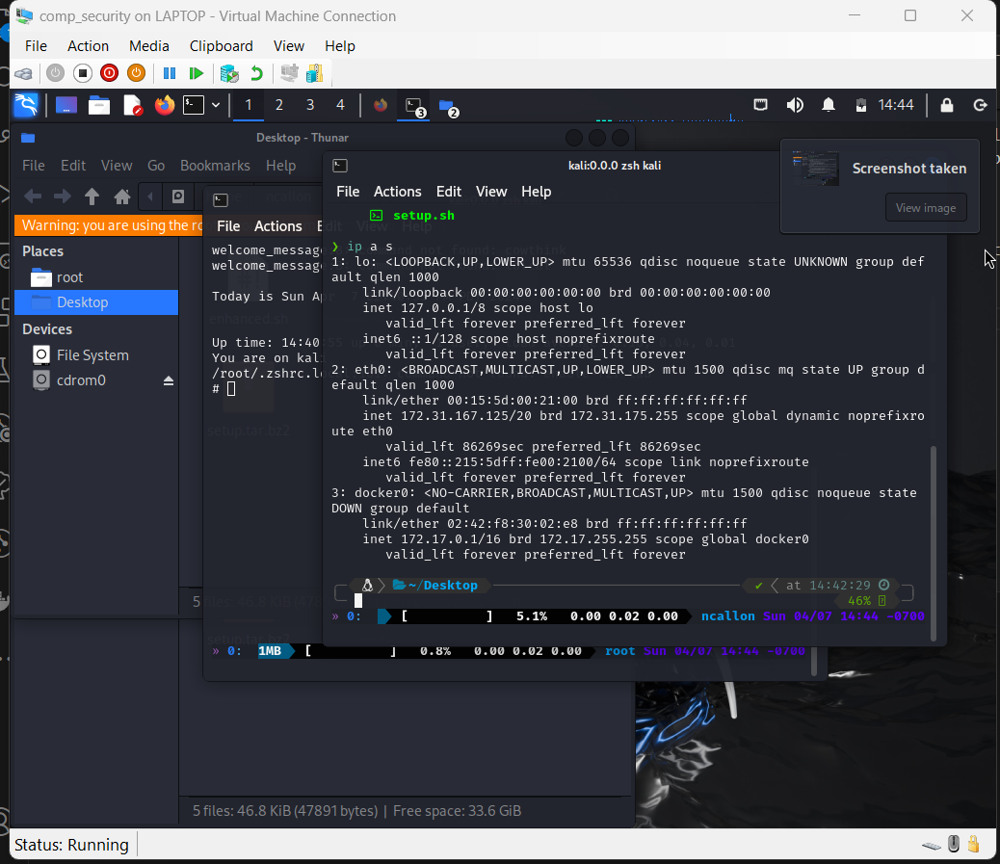

# Nathan Callon, 4/7/2024, Intro to Security

## Installing Windows 11 Education edition and Hyper-V, Kali-Linux

I installed kali-linux using the combination of the Enable-WindowsOptionalFeature -online -FeatureName Microsoft-Windows-Subsystem-Linux -All command, restarting and running wsl --install -d kali-linux. To access Hyper-V, I needed to obtain a license key using Microsoft azure and creating an account with ncallon@cecs.pdx.edu, verifying and entering the key I obtained from Azure into my laptop, and restarting, then going to system features, enabling Hyper-V, and restarting again. I also copied the install.ps1 script from the website and ran that using the Set-ExecutionPolicy Bypass -Scope Process -Force; ./install.ps1 command.

I downloaded the image successfully using the Invoke-WebRequest -Uri "https://kali.darklab.sh/kali-images/kali-2023.4/kali-linux-2023.4-installer-amd64.iso" -OutFile "kali-linux-2023.4-installer-amd64.iso" command despite it taking a large amount of time. I then checksummed with the command Get-FileHash -Algorithm SHA512 -Path .kali-linux-2023.4-installer-amd64.iso | Format-List.

I could now open Hyper-V manager and followed the instructions of creating a VM with the new Kali-Linux image and I named my virtual machine "comp_security", and gave it the username and password that I use for logging in ada for pdx. I unchecked the box for Enable Secure Boot and I typed in osuosl.org for the mirror and KDE for the desktop environment.

For the Enhanced session mode I ran the setup.sh that was provided and I made a new file called enhanced.sh with the script below the setup.sh which I ran as root, rebooted, and re-ran again to finish installation. This took a few hours as I had to reinstall the VM multiple times due to errors with the installation. Here is the output of the ip a s command:

I used curl -LO https://raw.githubusercontent.com/dkmcgrath/courses/main/netsec/setup.sh and also the enhanced_session.sh (to be safe) and after waiting a long period of time it finished installing.

