# Nathan Callon, 4/15/2024, Intro to Security

## Screenshot of room 1 completion

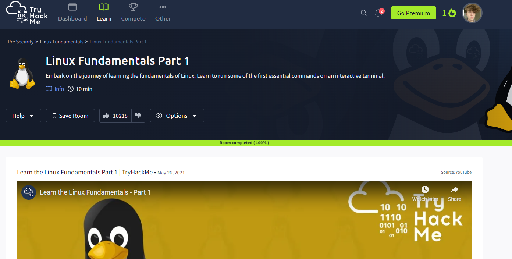

## Screenshot of room 2 completion

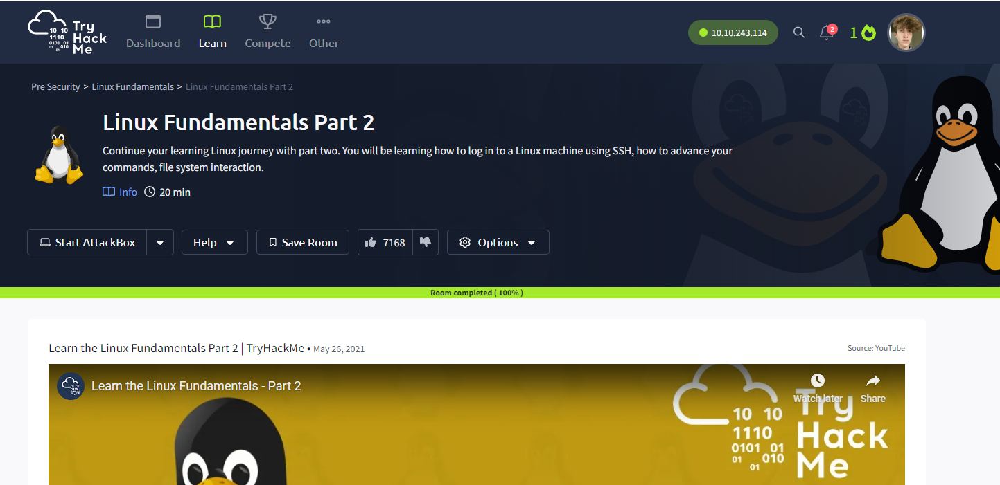

## Grep exercises

There were 3959 matches for grep -c "password" rockyou.txt:

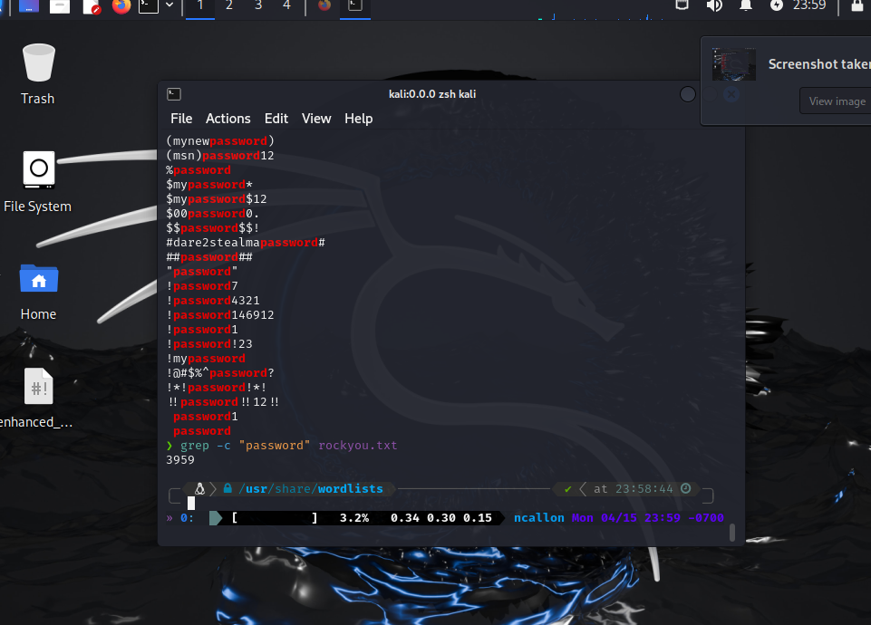

There were 4690 matches for the case insensitive version, grep -c "password" rockyou.txt:

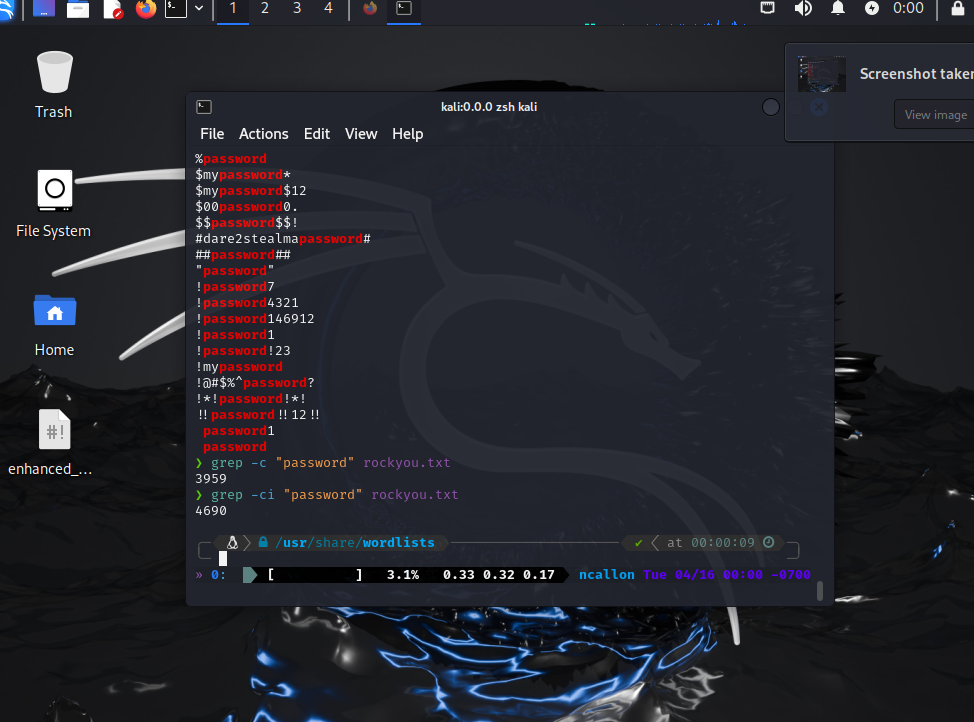

There were 5076161 matches for lines ending in 3 digits:

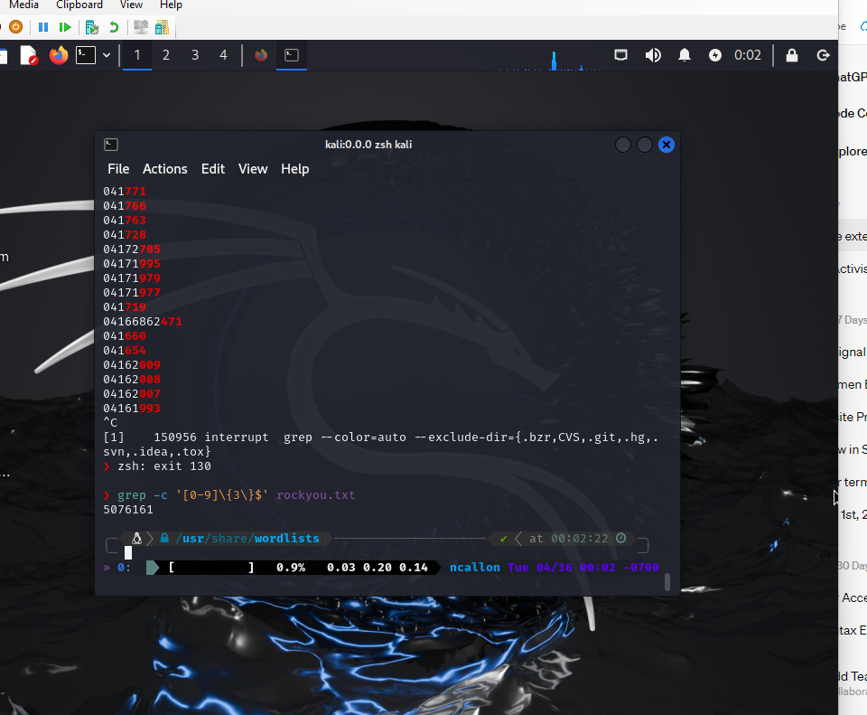

And there were 5774791 matches for lines that contain 3 digits in a row anywhere on the line:

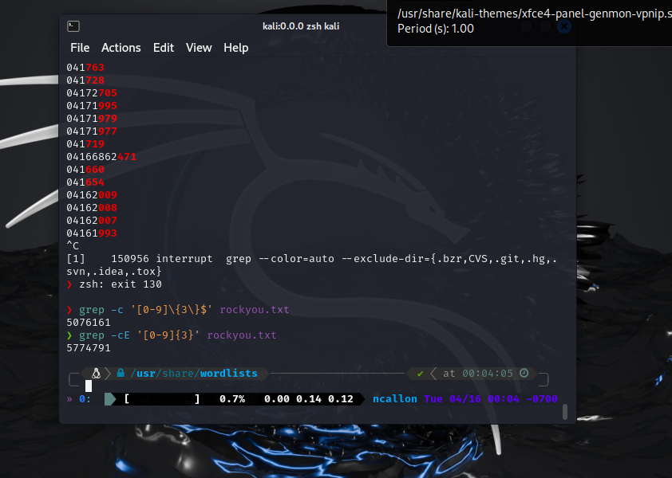

## Sed exercises

A command to replace all instances of "from this.that import something" to "from that import something"
applying to all the python files in the current directory would be:

```sh
sed -i 's/from this\.that import something/from that import something/g' \*.py
```

To print lines 312-345 of a file:

```sh
sed -n '312,345p' rockyou.txt
```

Altering sshd_config for ssh password authentication to no (I had to use sudo for this):

```sh
sudo sed -i 's/\#PasswordAuthentication yes/PasswordAuthentication no/g' sshd_config
```

## objdump, nm, and readelf

objdump can be very useful for disassembling files and displaying assembly code, like so:

Output of "objdump -d /bin/ls":

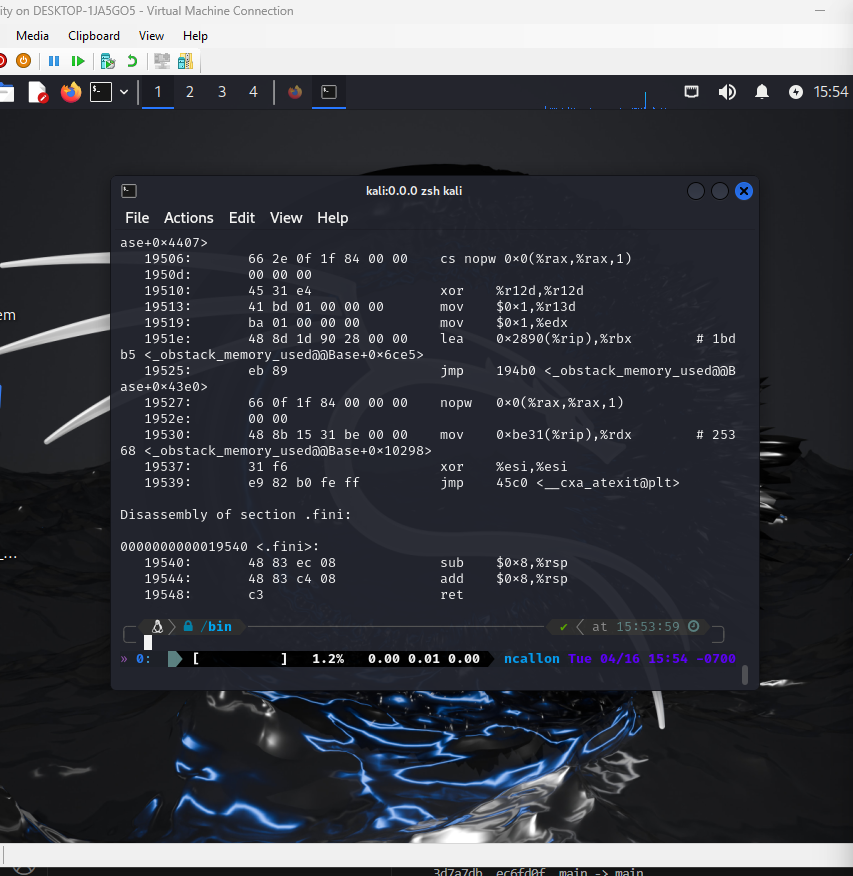

nm from the manual is good at finding symbols in object files, however this ls file does not have any symbols:

Output of "nm /bin/ls":

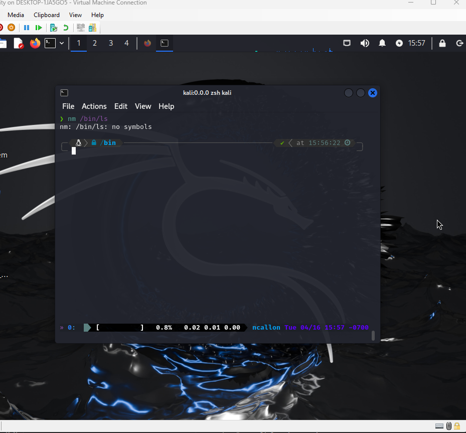

readelf is designed for ELF files (executable and linkable format), in which this case /bin/ls is, and specializes in finding section/program headers and can help with debugging.

For the command "readelf -S /bin/ls":

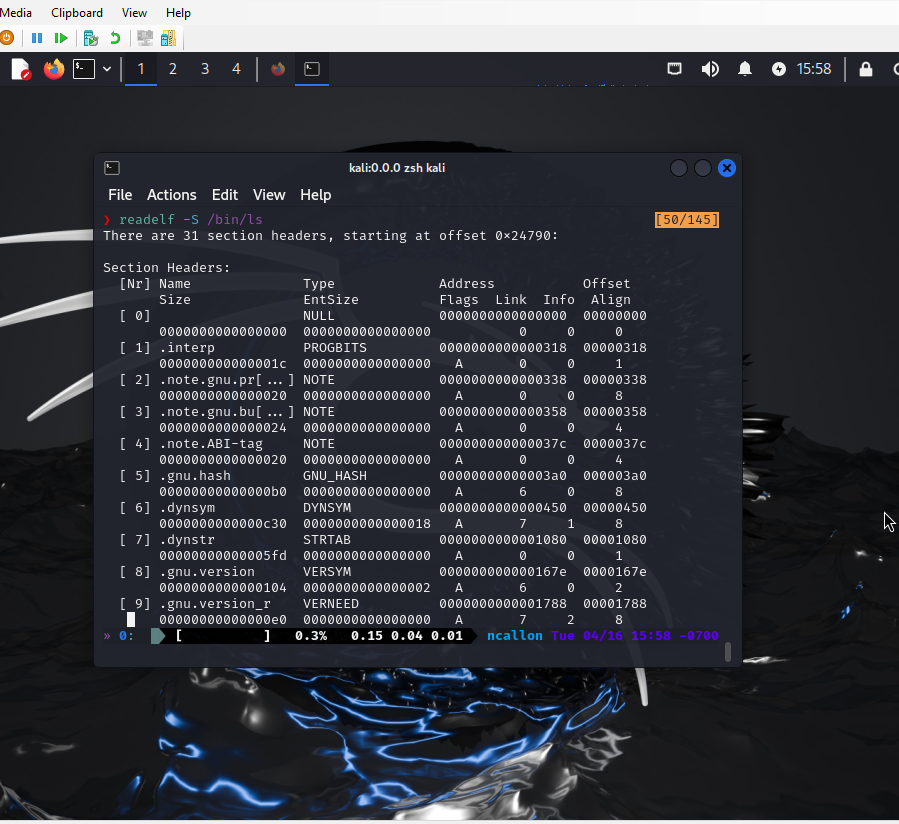

The three commands are different in than objdump is more about disassembling files, nm is focused solely on symbol information, and readelf is more focused on the ELF structure of files than objdump is.

## Virtual environment activation from anywhere

To get this to work, I started out by running "virtualenv" in the ~/ directory, and locating the activate file which for me is "~/env/bin/activate". I then created an activate script in /bin/, which had the contents:

```sh
#!/bin/bash

# Script to activate virtual environment

source ~/env/bin/activate
```

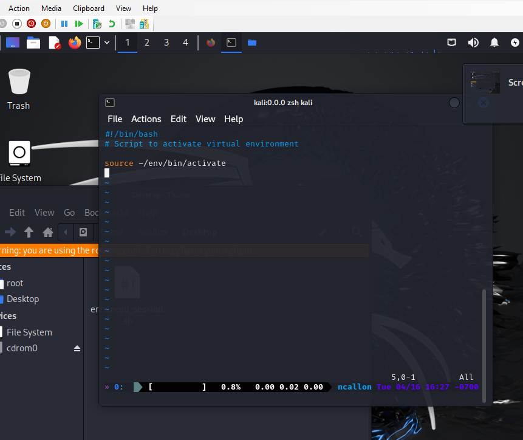

And lastly I edited my zshrc to include a function called "activate()":

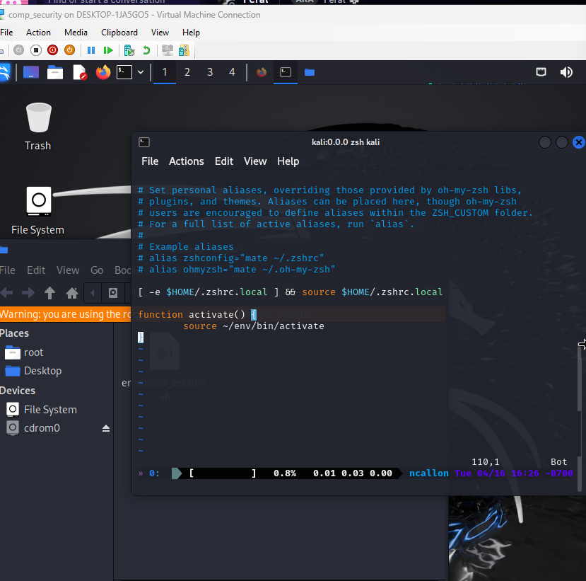

And after all of this, I refreshed the shell to now have this function and I could finally activate and deactivate the virtual environment by typing "activate" from anywhere.

## ps pipeline command on ada

For the command,

```sh
ps -efH --no-header | awk '{print $1}' | grep -Ev $(python3 -c 'import sys; print("|".join(sys.argv[1:]))' $(cut -f1 -d':' /etc/passwd)) | sort | uniq -c | sort -n
```

The grep portion of it uses the -v option to invert the results showing only results that do not match the pattern. The -E stands for extended regular expression.

The "cut -f1 -d':' /etc/passwd" section extracts the first field of each line in the passwd file which would be the usernames. The python3 portion takes the usernames and puts them into a single string delimited by | 's.

An alias is an easy way to shorten the length of commands you need to use a lot, and if you use this command a lot it would definitely be useful. One alias that I personally use is alias ls='ls -la', simply because I find that one much more detailed and readable.

Awk handles multiple whitespace and other delimiters much easier than cut so you could replace cut with it relatively easily. For the inverse, you'd want to format the text so it expects one single fixed delimiter, whether it be a whitespace or a comma so cut could handle it much easier.

You could use the paste command to accomplish what the python portion did by using paste along with the options "-sd'|' -", with -s putting all the names onto one line and -d specifying to use the | as a delimiter for all the names.

## Screenshot of room 3 completion

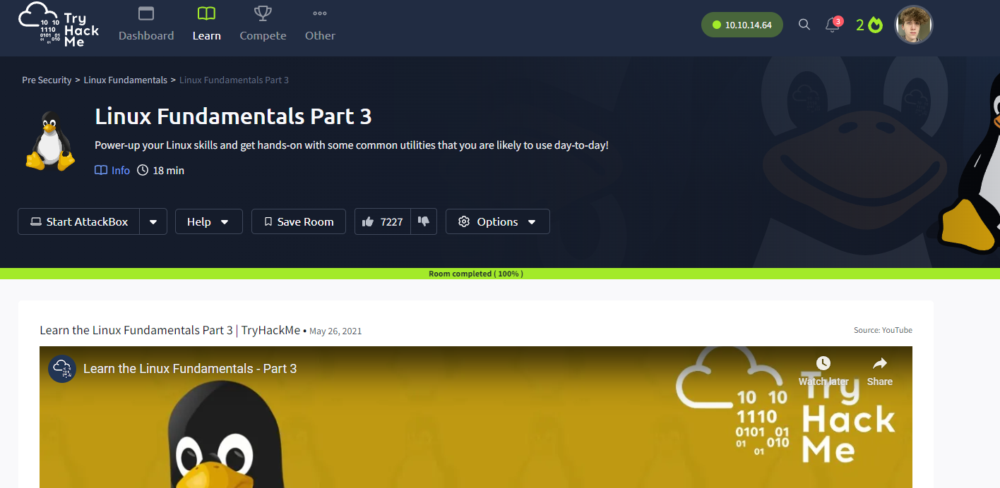

Odin ID: 945912805
PSU ID: ncallon
PSU email: ncallon@pdx.edu
