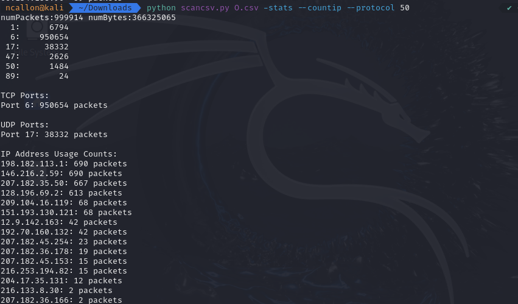

# Nathan Callon, 5/24/2024, Intro to Security, Homework 4

## Room 1 completion:


## Room 2 completion:


## Room 3 completion:


## Room 4 completion:


## 5. tcpdump exercises

1. Perform a tcpdump capture where you only capture DNS packets.

```
sudo tcpdump -i eth0 port 53 -v
```


2. Perform a tcpdump capture where you capture TCP packets that are destined for either port 443 or 8080, and originate from your computer.

```
sudo tcpdump -i eth0 'tcp and (dst port 443 or dst port 8080) and src host 172.25.255.251' -v
```


3. Perform a tcpdump capture where traffic is either UDP or TCP, is inbound to your computer, and destined for a port between 20000 and 35000.

```
sudo tcpdump -i eth0 '(tcp or udp) and dst portrange 20000-35000 and dst host 172.25.255.251' -v
```


## 6. Network traffic scripts

1/2. Modifying script to detect ports 1-1024 and count TCP and UDP:


3. For O.csv, due to the high number of TCP packets, I think it is a data center network.

For R.csv, due to the UDP being higher than TCP but both still high relative to eachother, I think it is most likely an ISP network.


4. Adding --countip option to script:


5. With R.csv, the results indicate lots of repeated use from some IP addresses reaching the tens of thousands, so I think it matches an ISP network.


With O.csv, there are lots of small amounts of packet usage cases from thousands and thousands of different IP addresses, so I think this reaffirms it might be a data center where people receive and input data from many different computers and only when needed.


6. It seems that for R.csv, network 10.5.63.0 dominates the network, and as well as 234.142.142.

For O.csv, it seems 207.182 has lots of packets, as well as 199.249.

7. Modifying script to use --protocol along with integer after it to filter:


GRE (47) appears none at all in R.csv, but 5,252 times total in O.csv.


IPSEC (50 and 51) appear 2,968 in O.csv, and none at all again in R.csv.




OSPF (89) appears 48 times in O.csv, and again, not at all in R.csv.


8. 192.245 also dominates the network in the packet list.

9. Due to data centers usually using OSPF a lot, and there only being 48 packets in O.csv, I'm not sure if I still think it's a data center. R.csv uses it 0 times, but ISPs dont use OSPF nearly as much as data centers, so I still think R.csv is an ISP network.

## Adding -connto option to script and sorting

After modifying script and adding connto option, making the most popular servers cluster at the end, with O.csv and R.csv respectively:


Final script:

```
from CSVPacket import Packet, CSVPackets
import sys
from collections import defaultdict

IPProtos = [0 for x in range(256)]
numBytes = 0
numPackets = 0

# Counters for TCP and UDP ports
tcpPorts = [0 for x in range(1025)]
udpPorts = [0 for x in range(1025)]

# Counter for IP addresses
ipCounter = defaultdict(int)

# Creating dictionary using lambda with an int
conn_dic = defaultdict(lambda: defaultdict(lambda: defaultdict(int)))

# Check for the '-stats' and '--countip' flags, and --protocol as well
stats = '-stats' in sys.argv
count_ip = '--countip' in sys.argv
connto = '--connto' in sys.argv

filter = None

if '--protocol' in sys.argv:
    protocol_index = sys.argv.index('--protocol')
    if protocol_index + 1 < len(sys.argv):
        filter = int(sys.argv[protocol_index + 1])

csvfile = open(sys.argv[1], 'r')

for pkt in CSVPackets(csvfile):
    numBytes += pkt.length
    numPackets += 1
    proto = pkt.proto & 0xff
    IPProtos[proto] += 1

    if pkt.proto == 6 or pkt.proto == 80:  # TCP
        tcpPorts[pkt.proto] += 1
    elif pkt.proto == 17 or pkt.proto == 53:  # UDP
        udpPorts[pkt.proto] += 1

    # Count IP addresses with protocol now
    if count_ip and (filter is None or pkt.proto == filter):
        if hasattr(pkt, 'ipsrc'):
            ipCounter[pkt.ipsrc] += 1
        if hasattr(pkt, 'ipdst'):
            ipCounter[pkt.ipdst] += 1

    if connto:
        if hasattr(pkt, 'ipsrc') and hasattr(pkt, 'ipdst'):
            if pkt.proto == 6 and hasattr(pkt, 'tcpdport'):
                proto_str = 'tcp'
                port = pkt.tcpdport
            elif pkt.proto == 17 and hasattr(pkt, 'udpdport'):
                proto_str = 'udp'
                port = pkt.udpdport
            else:
                proto_str = None
                port = None

            if proto_str and port <= 1024:
                conn_dic[pkt.ipdst][pkt.ipsrc][(proto_str, port)] += 1

if stats:
    print("numPackets:%u numBytes:%u" % (numPackets, numBytes))
    for i in range(256):
        if IPProtos[i] != 0:
            print("%3u: %9u" % (i, IPProtos[i]))
    print("\nTCP Ports:")
    for i in range(1025):
        if tcpPorts[i] != 0:
            print("Port %d: %u packets" % (i, tcpPorts[i]))
    print("\nUDP Ports:")
    for i in range(1025):
        if udpPorts[i] != 0:
            print("Port %d: %u packets" % (i, udpPorts[i]))

if count_ip:
    sorted_ips = sorted(ipCounter.items(), key=lambda item: item[1], reverse=True)
    print("\nIP Address Usage Counts:")
    for ip, count in sorted_ips:
        print("%s: %d packets" % (ip, count))

if connto:
    # Generate summary output for conn_dic
    summary = []
    for ipdst, src_dict in conn_dic.items():
        distinct_ipsrc = len(src_dict)
        ports = defaultdict(int)
        for ipsrc, port_dict in src_dict.items():
            for (proto, port), count in port_dict.items():
                ports[(proto, port)] += 1
        port_list = ', '.join([f"{proto}/{port}" for (proto, port) in sorted(ports.keys())])
        summary.append((distinct_ipsrc, ipdst, port_list))

    # Sort by # of IPs
    summary.sort(reverse=False)

    print("\nConnection Summary:")
    for distinct_ipsrc, ipdst, port_list in summary:
        print(f"ipdst {ipdst} has {distinct_ipsrc} distinct ipsrc on ports: {port_list}")


if not stats and not count_ip and not connto:
    sys.exit(0)
```

Odin ID: 945912805
PSU ID: ncallon
PSU email: ncallon@pdx.edu
