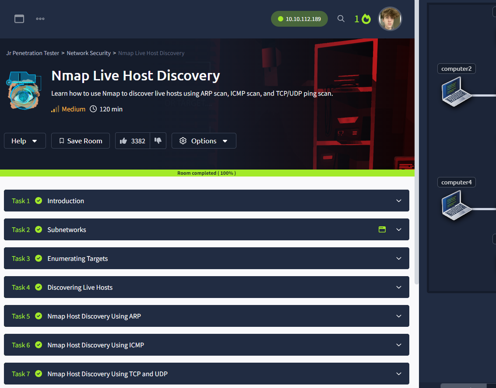

# Nathan Callon, 5/24/2024, Intro to Security, Homework 4

## Room 1 completion:


## Room 2 completion:


## Room 3 completion:


## Room 4 completion:



## 5. tcpdump exercises

1. Perform a tcpdump capture where you only capture DNS packets.

```
sudo tcpdump -i eth0 port 53 -v
```


2. Perform a tcpdump capture where you capture TCP packets that are destined for either port 443 or 8080, and originate from your computer.

```
sudo tcpdump -i eth0 'tcp and (dst port 443 or dst port 8080) and src host 172.25.255.251' -v
```


3. Perform a tcpdump capture where traffic is either UDP or TCP, is inbound to your computer, and destined for a port between 20000 and 35000.

```
sudo tcpdump -i eth0 '(tcp or udp) and dst portrange 20000-35000 and dst host 172.25.255.251' -v
```


## 6. Network traffic scripts

1/2. Modifying script to detect ports 1-1024 and count TCP and UDP:


3. For O.csv, due to the high number of TCP packets, I think it is a data center network.

For R.csv, due to the UDP being higher than TCP but both still high relative to eachother, I think it is most likely an ISP network.


4. Adding --countip option to script:


5. With R.csv, the results indicate lots of repeated use from some IP addresses reaching the tens of thousands, so I think it matches an ISP network.


With O.csv, there are lots of small amounts of packet usage cases from thousands and thousands of different IP addresses, so I think this reaffirms it might be a data center where people receive and input data from many different computers and only when needed.


Odin ID: 945912805
PSU ID: ncallon
PSU email: ncallon@pdx.edu
