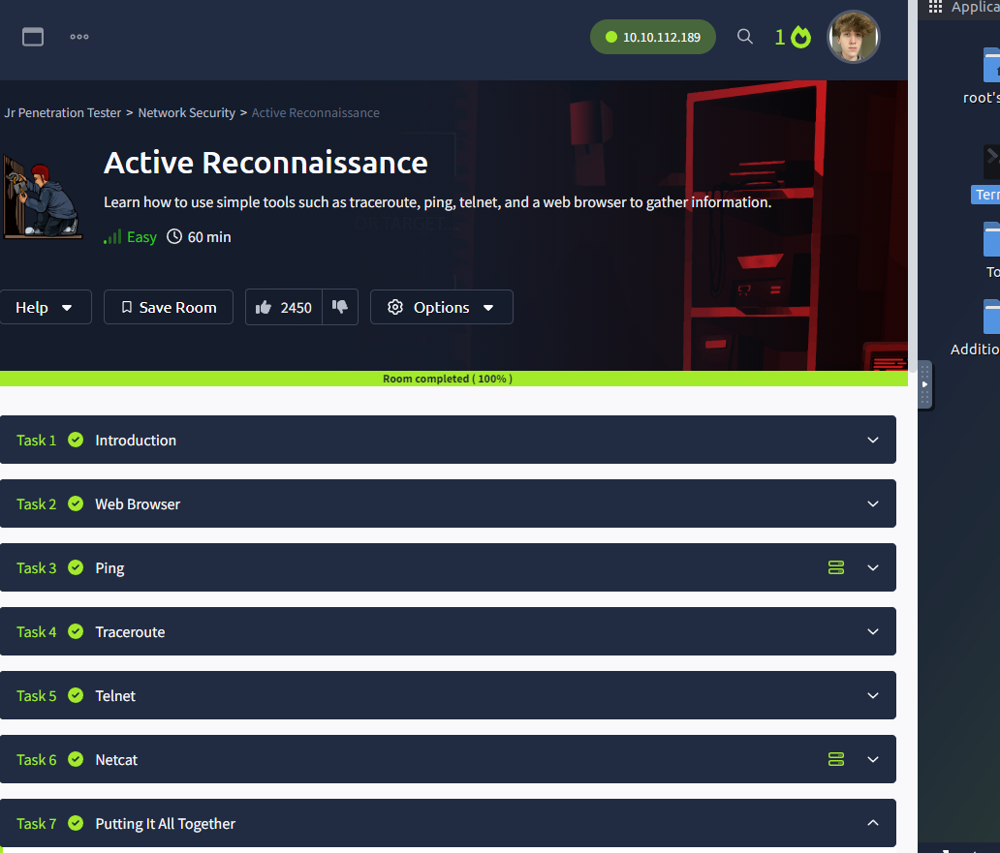

# Nathan Callon, 5/24/2024, Intro to Security, Homework 4

## Room 1 completion:


## Room 2 completion:


## Room 3 completion:



## Room 4 completion:


## 5. tcpdump exercises

1. Perform a tcpdump capture where you only capture DNS packets.

```
sudo tcpdump -i eth0 port 53 -v
```


2. Perform a tcpdump capture where you capture TCP packets that are destined for either port 443 or 8080, and originate from your computer.

3. Perform a tcpdump capture where traffic is either UDP or TCP, is inbound to your computer, and destined for a port between 20000 and 35000.
