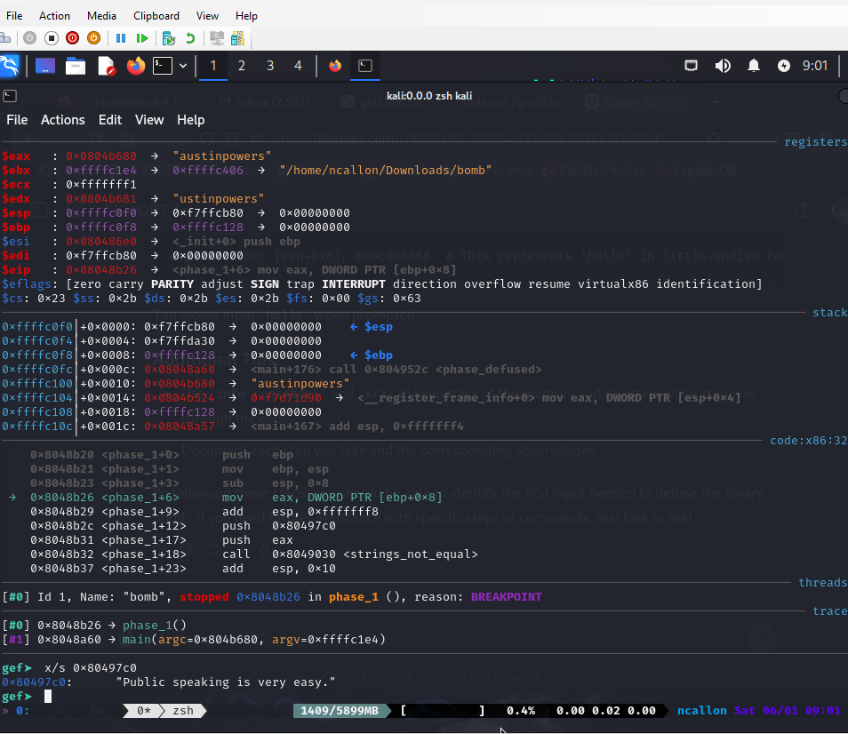

# Nathan Callon, 6/1/2024, Intro to Security, Homework 4

## Running the bomb with gdb + gef for the first time:

Stepping through with next after b main:

Found initialize_bomb() function:

Bomb blown up, going to use objdump and string to generate text files I can use:

objdump:

strings:

Found the text when phases are defused, including a secret stage:

Attempting different interesting strings I found in the string.txt, but not working:

Think I finally found a clue! About to test it:

Worked!! Phase 1 done.

"Public speaking is very easy."

I notice a read_six_numbers function and explode_bomb functions for phase_2.

With read_six_numbers, I'm testing first with "1 2 3 4 5 6" just to see what the assembly will do with the numbers I put, and so I can check the registers.

I see two cmps, and I know that 0x1 is 1 in decimal so that the first input should be 1. The second one seems to use esi+ebx\*4 and eax which are changing in a loop I assume, so we will find out what it is for each iteration.

I look at the first compare (that's not the obvious 0x1) using the "until \*0x08048b7e" command at the address and I use "i r" to see eax is 0x2, or 2 in decimal.

I use the same until agin, and now I see 0x6, or 6. Now I am trying "1 2 6 4 5 6".

I repeat and I see 0x18 (24), and add this so I now I have "1 2 6 24 5 6".

Now found 0x78, which is 120.

Found 0x2d0, which is 720.

Now input "1 2 6 24 120 720", and wallah! It worked.

For phase_3, the first thing I notice is many different cmps followed by explode_bomb. I notice the first compare uses 0x80497de for eax.

It seems the input wants an integer, then a character, then an integer:

To get further into the code, I use the pattern "1 a 1", aka int char int, to see where it takes me now.

I see that the first value after the lea assembly line to be compared is 0xd6 or 214.

I now try this with "1 a 214", as 1 worked for the first digit.

I see that bl is the final compare, and I use "until \*0x8048c8f" to be able to see bl in the latest context, which despite giving weird errors shows me the value "0x62".

I know that this is a character, so if we use a ASCII table to see 0x62, and we go to the ASCII table and see which character this corresponds to:

So I am now trying "1 b 214":

And it works!

I set a breakpoint at phase_4, and I start out by seeing the same sscan format checker I saw in phase_3:

Odin ID: 945912805
PSU ID: ncallon
PSU email: ncallon@pdx.edu
