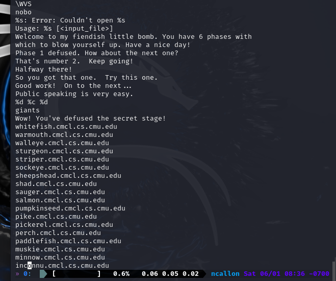
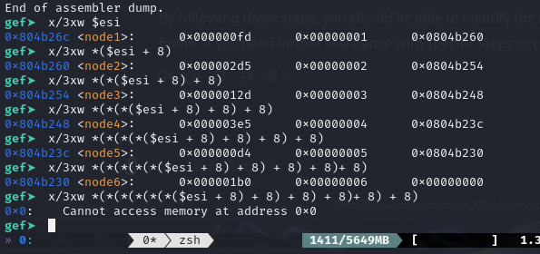

# Nathan Callon, 6/1/2024, Intro to Security, Homework 4

## Running the bomb with gdb + gef for the first time:

Stepping through with next after b main:

Found initialize_bomb() function:

Bomb blown up, going to use objdump and string to generate text files I can use:

objdump:

strings:

Found the text when phases are defused, including a secret stage:

Attempting different interesting strings I found in the string.txt, but not working:

Think I finally found a clue! About to test it:

Worked!! Phase 1 done.

"Public speaking is very easy."

I notice a read_six_numbers function and explode_bomb functions for phase_2.

With read_six_numbers, I'm testing first with "1 2 3 4 5 6" just to see what the assembly will do with the numbers I put, and so I can check the registers.

I see two cmps, and I know that 0x1 is 1 in decimal so that the first input should be 1. The second one seems to use esi+ebx\*4 and eax which are changing in a loop I assume, so we will find out what it is for each iteration.

I look at the first compare (that's not the obvious 0x1) using the "until \*0x08048b7e" command at the address and I use "i r" to see eax is 0x2, or 2 in decimal.

I use the same until agin, and now I see 0x6, or 6. Now I am trying "1 2 6 4 5 6".

I repeat and I see 0x18 (24), and add this so I now I have "1 2 6 24 5 6".

Now found 0x78, which is 120.

Found 0x2d0, which is 720.

Now input "1 2 6 24 120 720", and wallah! It worked.

For phase_3, the first thing I notice is many different cmps followed by explode_bomb. I notice the first compare uses 0x80497de for eax.

It seems the input wants an integer, then a character, then an integer:

To get further into the code, I use the pattern "1 a 1", aka int char int, to see where it takes me now.

I see that the first value after the lea assembly line to be compared is 0xd6 or 214.

I now try this with "1 a 214", as 1 worked for the first digit.

I see that bl is the final compare, and I use "until \*0x8048c8f" to be able to see bl in the latest context, which despite giving weird errors shows me the value "0x62".

I know that this is a character, so if we use a ASCII table to see 0x62, and we go to the ASCII table and see which character this corresponds to:

So I am now trying "1 b 214":

And it works!

I set a breakpoint at phase_4, and I start out by seeing the same sscan format checker I saw in phase_3:

We can see it wants an integer:

Something new I haven't seen is this function called "func4". Right after, it compares our eax to 0x37 with is 55 in decimal. I'm assuming that whatever integer we input, must be turnt into 55 by func4().

I do a disassembly dump of func4 to see exactly what it is doing. I start out by noticing that it is a recursive function, calling itself with a base case of 1, setting eax to 1 to reach this base case if the code has the wrong input:

I look at the two recursive calls and figure out that this represents the Fibonacci sequence, and I explain why this is the case in the screenshot:

We can see that the nth number for 55 is 10, where F10 is 55:

So if we plug in the previous number, which would be the 9th on the Fibonacci list, and would add F8 to combine to make 55, then this should plug in to reach 55 with the Fibonacci formula:

F9 (34) + F8 (21) = 55

And it works!

For phase_5 I start out with the test input "test test 123" just to proceed, and set a breakpoint and disassemble. The first thing you can notice is the "string_length", followed by comparing eax to 0x6 or 6, which if comparison is failed then explode_bomb is called. I'm assuming this means that the string_length should be 6 characters for eax.

Just like in some previous phases, you can tell a loop is occuring by a single increment on edx and then it being compared with 0x5. This means that when edx reaches 5 it will stop looping, so it is a loop from 0-5 or 6 loops.

I assume the program is going to crash before I get further if I don't input 6 characters so I do that with "abcdef" before I inspect the assembly code before the "strings_not_equal".

I use an until to view eax at the latest stage before strings_not_equal.

eax has an interesting value of "srveaw", which it transformed abcdef into. I see the goal is to transform this into "giants", so we must find out what to type in to make this cypher transform our string into "giants".

When I look at $esi I see an array which I assume is used for the cypher:

Going back to the code, I see that the only operation in the loop is using AND with the array elements:

When you use this with each element in the array, you will find that one of the possible answers is opekmq:

Now setting breakpoint for final phase_6 and disassembling:

I first notice a combination of different things I learned from the earlier phases. I see read_six_numbers, knowing that this must be 6 integers. I also see many different "inc"s, indicating loops, but we need to find out what each of them do. There is also a "dec" this time.

What I have noticed so far:

There are many comparisons and jumps to other loops with other comparisons if these compares return true.

You can see the input (which we know is integers from read_six_numbers) is being compared right before a "Jump not equal" statement.
So if any of these inputs are equal, that is the only way explode_bomb is called as you can see right here:

So we know that none of the integers should be matching, they all need to be unique numbers. For the eax compare, you can see that it "Jumps if below or equal" to 0x5 and will explode the bomb if this is not met, and because eax was just decremented (1 less than it just was), we know the integers must all be less than or equal to 6.

With all these we know the numbers must be a combination of 1 2 3 4 5 and 6 distinctly, but we must find out what order.

First, so we can get further in the code, let's start with 1 2 3 4 5 6 as our test input to get further without exploding.

This is far as we get before the explosion, so let's look at the code right before that to figure out what it's doing. Already I see a loop of 5:

This is using esi, so let's inspect esi and see what it is storing:

We see a node that stores 3 addresses. Lets use pointer arithmetic by 8 (what phase_6 is incrementing it by earlier before putting into edx) to see what the next values look like.

We see it says "node1, node2, node3" etc. and the second column corresponds with the node number. The first column looks like it represents the value of a node in a linked list and that the third column is the pointer to the next node.

The "Jump if greater or equal" to continue the loop is comparing if edx which is (esi + 0x8, the node ahead in the list) is smaller than eax (esi), or it explodes. So the nodes have to be ordered from greatest to lowest in order for the jump to keep succeeding until on <+234> it will finally escape the outermost loop and the bomb will be defused.

So to sort the values of the nodes from highest to lowest:

We have:

0x0fd - node1

0x2d5 - node2

0x12d - node3

0x3e5 - node4

0x0d4 - node5

0x1b0 - node6

We want to sort these from greatest to lowest, so we get:

0x3e5 - node4

0x2d5 - node2

0x1b0 - node6

0x12d - node3

0x0fd - node1

0x0d4 - node5

So the combination should be 4 2 6 3 1 5.

Let's see if this works:

Making sure nodes are in order:

Success!!!!!

Odin ID: 945912805
PSU ID: ncallon
PSU email: ncallon@pdx.edu
